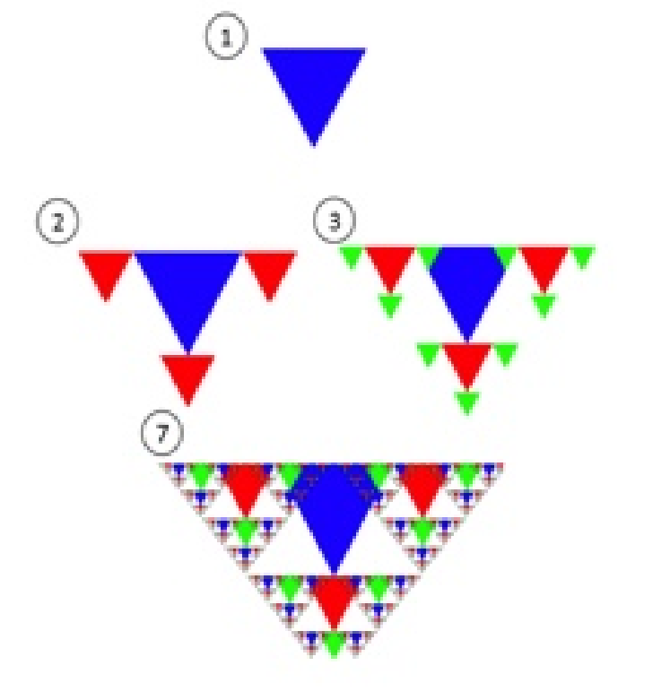
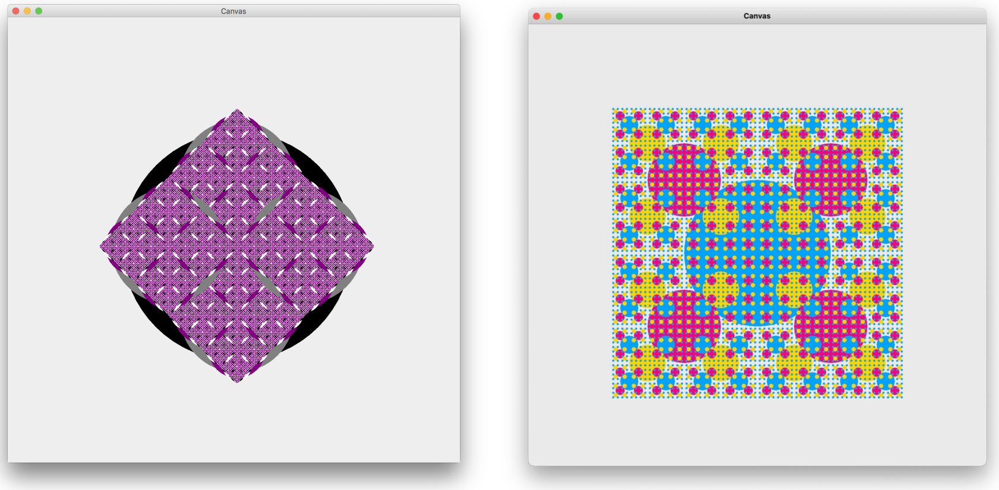
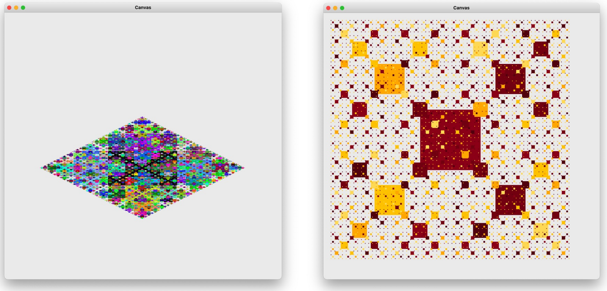

# CSCI 1933 Project 1: Shapes and Fractals
Welcome to the first CSCI 1933 project! All students are expected to understand the rules listed
below. While some rules may seem unforgiving, all guidelines are made to help the TAs grade
efficiently and fairly. **As a result, we will generally not make exceptions.** Rules listed in the syllabus also apply but may not be listed here.

### **Make sure you read this entire write-up *carefully* before starting your project.**

### **Do not distribute or post this project outside of the course.**
## Submission
* Project 1 is due on Monday, February 23 at 11:55pm CST on **Gradescope**.
    * The project can be submitted up to two days late, with a penalty: -10% for each day late.

## Local Compilation & Run Instructions
* In your terminal make sure that you are in the `CSCI-1933-Student-Code` directory NOT the CSCI1933P1 directory.
    * If you are inside of the `CSCI1933P1` directory, type `cd ..` into the terminal and press enter.
* To compile your code locally type `javac CSCI1933P1/FractalProgram.java` into the terminal and press enter.
* To run your code locally type `java CSCI1933P1.FractalProgram` into the terminal and press enter.
* **IMPORTANT: Do not submit any .class files to gradescope, the only files you should submit are found below.**

### EXTREMELY IMPORTANT: `package CSCI1933P1;` should be on the FIRST LINE of all java files you submit. This is necessary for the autograder to work.

### Inside of the project01 repository, you are given these files:
* Canvas.java (DO NOT EDIT)
* FractalDrawer.java (Template provided)
* FractalProgram.java (Template provided)


### Your project submission must adhere to the following rules. Failure to do so will impact your grade.
* Your submission should be one ZIP file named ```<partner1 x500>_<partner2 x500>_Project1.zip```
    * This ZIP file should contain **ONLY** these files:
        * Canvas.java (DO NOT EDIT)
        * FractalDrawer.java
        * FractalProgram.java
        * Triangle.java
        * Rectangle.java
        * Circle.java
        * **INFO.txt**

### For example, this is a valid project submission:
* kvant003_balle137_Project1.zip
   * Canvas.java (DO NOT EDIT)
   * FractalDrawer.java
   * FractalProgram.java
   * Triangle.java
   * Rectangle.java
   * Circle.java
   * **INFO.txt**


<u>**NOTE: The provided Canvas.java class is not to be modified.**</u>
<br>
You are allowed to change or modify your submission, so submit early and often, and
verify that all your .java files are in the submission. Failure to submit the correct files will result
in a score of zero for all missing parts. Late submissions will be penalized in accordance with the
syllabus.

<h3><u>IMPORTANT: INFO.txt</u></h3>

**Make sure to include a INFO.txt in your submission that contains the following information (10 point deduction if missing):**
* Group members’ names and x500s
* Contributions of each partner (if working with a partner)
* How to compile and run your program
* Any assumptions
* Additional features that you implemented (if applicable)
* Any known bugs or defects in the program
* Any outside sources (aside from course resources) consulted for ideas used in the project, in the format:
    * idea1: source
    * idea2: source
    * idea3: source
* Include the statement: **“I certify that the information contained in this INFO file is complete and accurate. I have both read and followed the course policies in the ‘Academic Integrity - Course Policy’ section of the course syllabus.”** and type your name(s) underneath.

<u>**NOTE: Incomplete INFO.txt files will result in point deductions towards your project submission.**</u>

## Working with a partner
As discussed in lecture, you may work with one partner to complete this assignment. If you choose
to work as a team, please only turn in one copy of your assignment into Gradescope (add your partner to your submission group on Gradescope). 

Include both of your names and x500s in a comment at the top of each file you submit. In doing so, you are attesting to the fact that both of you have contributed substantially to completion of the project and that both of you understand all code that has been implemented.

## Identification
Include your name and x500 in a comment in all files you submit, even when not working with a
partner. Example: `// Written by Christopher Dovolis, dovol002`

## Questions
Questions related to the project can be discussed with peers in lecture/lab/Discord only in abstract. Such questions might relate to programming in Java, understanding the writeup, or topics covered
in lectures and labs. **Do not post any code or solutions publicly.** 

Questions that require explaining your solution or posting your code can be asked to TAs in office hours or through help tickets in Discord.

## Grading
Grading will be done by the TAs, so please address grading problems via *Regrade Requests* on Gradescope.

## Code Style (5 Points)
Part of your grade will be decided based on the “code style” demonstrated by your programming. In general, all projects will involve a style component. This should not be intimidating, but it is fundamentally important.

### The following items represent “good” coding style:
* **Use effective comments** to document what important variables, functions, and sections of the code are for. In general, the TA should be able to understand your logic through the comments left in the code.
    * *Try to leave comments as you program, rather than adding them all in at the end. Comments should not feel like arbitrary busy work - they should be written assuming the reader is fluent in Java, yet has no idea how your program works or why you chose certain solutions.*
* **Use effective and standard indentation.**
* **Use descriptive names for variables.** Use standard Java style for your names: ```ClassName```, ```functionName```, ```variableName``` for structures in your code, and ```ClassName.java``` for the file names.

Try to avoid the following stylistic problems:
* Missing or highly redundant, useless comments. ```int a = 5; //Set a to be 5``` is not helpful.
* Disorganized and messy files. Poor indentation of braces (```{``` and ```}```).
* Incoherent variable names. Names such as ```m``` and ```numberOfIndicesToCount``` are not useful. The former is too short to be descriptive, while the latter is much too descriptive and redundant.

The programming exercises detailed in the following pages will both be evaluated for code style. This will not be strict – for example, one bad indent or one subjective variable name are hardly a problem. 
<br>
**However, if your code seems careless or confusing, or if no significant effort was made to document the code, then points will be deducted.**

## Pulling the Project Files

Git is a version control system that helps you track changes to files in a project. We have been using it in labs for a while now, and cloning this project will follow the same steps as a lab.

Open your terminal/command line, and navigate to the top of the `CSCI-1933-Student-Code` directory using the `cd` command. Now, type the following:

```bash
  git pull
```


#### Note: If you want to set up your own repository for this project, you will need to move the `project01` directory into your new repository. Make sure your new repository is PRIVATE, so your work is not visible to others (besides you and your partner).


## Project Overview
Project 1 will involve implementing several shape classes in Java and using a drawing class we have implemented for you to create a fractal based on your shapes **using recursion**.

Classes you will need to create (more information in the following sections):
* Triangle.java
* Rectangle.java
* Circle.java

Classes you will need to edit (more information in the following sections):
* FractalDrawer.java
* FractalProgram.java

Classes given to you (no need to edit):
* Canvas.java

# Shape Classes (45 Points)
You should design classes for three different shapes (triangle, square, and circle) with the specifications listed below. These classes are to be used by the main program, FractalProgram.java (contains the “main” method), and passed to the Canvas class for drawing. Thus, they must use standard class names and method names in order to work correctly. We will leave class attributes up to you, looking at the values that can be set is a good place to start.

### IMPORTANT: The TAs will be using automated tests to grade your submissions so make sure to use the given method signatures i.e. the function names, order of the input parameters and the output type match the ones given.

*Note: In Java, both integer and floating point division are performed using the / operator. Integer division floors the result of the division- for example, 1/2 will produce 0, rather than the (expected) 0.5. Make sure that if you use any division in your methods for the shape classes, at **least one** of the operands is of type double. For example, 1.0/2, 1/2.0, and 1.0/2.0 will all produce 0.5.*

**IMPORTANT: In order to use Color in this project, you will need to `import java.awt.Color;` at the top of each shape class.**

## Circle Class Methods

Assume all methods inside the Circle class are public unless stated. Text inside of parentheses is the type of the input or output.

* Constructor (Function name should be: Circle) <br> **Input:** x position (double), y position (double), radius (double)

* calculatePerimeter <br> **Input:** none <br> **Output:** perimeter of the circle (double)

* calculateArea <br> **Input:** none <br> **Output:** area of the circle (double)

* setColor <br> **Input:** color of the shape (Color) <br> **Output:** none (void)

* setPos <br> **Input:** x (double), y (double) <br> **Output:** none (void) <br> *Note: The x and y parameters set the new position of the center of the circle.*

* setRadius <br> **Input:** radius (double) <br> **Output:** none (void)

* getColor <br> **Input:** none <br> **Output:** color of the shape (Color)

* getXPos <br> **Input:** none <br> **Output:** x position of the center (double)

* getYPos <br> **Input:** none <br> **Output:** y position of the center (double)

* getRadius <br> **Input:** none <br> **Output:** radius of the circle (double)

## Triangle Class Methods

Assume all methods inside the Triangle class are public unless stated. Text inside of parentheses is the type of the input or output.
*Hint: Assume the triangles that are drawn are isosceles triangles.*

* Constructor (Function name should be: Triangle) <br> **Input:** x position (double), y position (double), width (double), height (double) <br> *Note: The x and y parameters are the position of the bottom-left vertex of the triangle.*

* calculatePerimeter <br> **Input:** none <br> **Output:** perimeter of the triangle (double)

* calculateArea <br> **Input:** none <br> **Output:** area of the triangle (double)

* setColor <br> **Input:** color of the shape (Color) <br> **Output:** none (void)

* setPos <br> **Input:** x (double), y (double) <br> **Output:** none (void) <br> *Note: The x and y parameters set the new position of bottom-left vertex of the triangle.*

* setHeight <br> **Input:** height (double) <br> **Output:** none (void)

* setWidth <br> **Input:** width (double) <br> **Output:** none (void)

* getColor <br> **Input:** none <br> **Output:** color of the shape (Color)

* getXPos <br> **Input:** none <br> **Output:** x position of the bottom-left vertex (double)

* getYPos <br> **Input:** none <br> **Output:** y position of the bottom-left vertex (double)

* getHeight <br> **Input:** none <br> **Output:** height (double)

* getWidth <br> **Input:** none <br> **Output:** width (double)

## Rectangle Class Methods

Assume all methods inside the Rectangle class are public unless stated. Text inside of parentheses is the type of the input or output.

* Constructor (Function name should be: Rectangle) <br> **Input:** x position (double), y position (double), width (double), height (double) <br> *Note: The x and y parameters are the position of the top-left vertex of the rectangle.*

* calculatePerimeter <br> **Input:** none <br> **Output:** perimeter of the rectangle (double)

* calculateArea <br> **Input:** none <br> **Output:** area of the rectangle (double)

* setColor <br> **Input:** color of the shape (Color) <br> **Output:** none (void)

* setPos <br> **Input:** x (double), y (double) <br> **Output:** none (void) <br> *Note: The x and y parameters set the new position of top-left vertex of the rectangle.*

* setHeight <br> **Input:** height (double) <br> **Output:** none (void)

* setWidth <br> **Input:** width (double) <br> **Output:** none (void)

* getColor <br> **Input:** none <br> **Output:** color of the shape (Color)

* getXPos <br> **Input:** none <br> **Output:** x position of the top-left vertex (double)

* getYPos <br> **Input:** none <br> **Output:** y position of the top-left vertex (double)

* getHeight <br> **Input:** none <br> **Output:** height (double)

* getWidth <br> **Input:** none <br> **Output:** width (double)

# FractalDrawer Class (45 Points)
For this part of the project, you will write a Java program that uses your shape classes to draw
a fractal. Fractals are geometric patterns that repeat on themselves at smaller and smaller scales.They have been studied for centuries because of their interesting mathematical properties and often appear in natural objects (e.g. snow flakes, plants). Fractals are also a classic application of **recursion**; you can read more about fractals and their history <a href="https://en.wikipedia.org/wiki/Fractal" target="_blank">here</a>. Consider the example below, which illustrates the process of constructing a fractal composed of triangles at several steps in the process. Notice that at each step, triangles of increasingly smaller sizes are drawn at the three points of each existing triangle. *More examples of fractals can be found at the end of this document.*



To help you with the drawing, we’ve already implemented a Canvas class that supports all of the drawing capability you need. You should look at the code if you’re interested, but all you’ll need to know is how you can interact with Canvas objects. 
<br>
Here are the method specifications of the Canvas class:
* ```Canvas()``` (default constructor): Creates a canvas of default size (800 pixels * 800 pixels)

* ```Canvas(int height, int width)```: Creates a canvas of specified height and width.

* ```void drawShape(Circle circleObj)```: Draws the passed in Circle object.

* ```void drawShape(Triangle triangleObj)```: Draws the passed in Triangle object.

* ```void drawShape(Rectangle RectangleObj)```: Draws the passed in Rectangle object.

Each of the drawing methods will draw the shape you pass in. This method accesses the color, position, and other attributes of the shape to draw it on the canvas. 
<br>
Here’s an example of how you might use the Canvas class to draw a single blue circle:

```Java
Canvas drawing = new Canvas(800,800);
Circle myCircle = new Circle(0,0,100);
myCircle.setColor(Color.BLUE);
drawing.drawShape(myCircle);
```

**IMPORTANT: Java(JFrame) uses a coordinate system where the origin is in the upper left-hand corner. As either the x and/or increases, the shape will move right and/or down. *See the visual below.***


You will be responsible for filling in the FractalDrawer class.
<br> 
### For full credit, your program should have the following features:
* Draw a pattern that repeats on itself ***at least 7 times*** and uses a new color in each repetition(feel free to be creative - you can cycle colors or choose colors at random, as long as overlapping shapes are distinct from one another).<br>
**IMPORTANT: The pattern must repeat on itself *using recursion* for full credit. Changing a shape’s size or position should be involved in recursive calls.**

* Draw **at least four shapes per layer for rectangles and circles** and **at least three per layer for triangles** (e.g. draw the new shapes on all three points or sides of a triangle, or on four opposite sides of a circle - again, feel free to be creative).<br> **IMPORTANT: If nothing appears on the canvas when you run your program, or of only a partial fractal appears, try resizing the canvas window. If you need to do this to display the entire fractal, you will not be penalized. The TAs are aware that many fractals will only appear after resizing the window.**

* Compute the **total area of all shapes that form your fractal** and print the result to the screen after your program is finished drawing. You do not need to take into account any overlap, simply sum the area of all the shapes that were drawn, even if they overlap each other.

*Hint: The most convenient implementation is to simply implement three different methods, one that draws a circle fractal, one that draws a triangle fractal, and one that draws a rectangle fractal.*

# FractalProgram Class (5 Points)
The FractalProgram class contains only the "main" method for this program.

*Note: you will need to import the scanner class for this class using:* ```import java.util.Scanner;```
### The main method will run as follows:
* Create a new Scanner object.
* Print out fractal shape choices (triangle, rectangle, circle).
* Read in user input using the previously instantiated Scanner object.
* Create a new FractalDrawer object.
* Call the drawFractal(String (pass in user input)) method on the FractalDrawer object, and assign it to a variable for the total area.
* Print out the total area of the fractal.

# Grading Information

### Your program will be graded according to the following score breakdown:
* **Code Style:** 5 points

* **Shape Classes:** 45 points

* **FractalDrawer Class:** 45 points

* **FractalProgram Class:** 5 points

# More Fractal Examples
Here are some examples of fractals for all three shapes, if you want some inspiration. Your fractal patterns do not have to match these; feel free to come up with your own patterns, as long as they meet the basic requirements listed in the <a href="https://github.umn.edu/CSCI-1933/project01#for-full-credit-your-program-should-have-the-following-features">FractalDrawer Class</a> section!
<br>

<br>

<br>


# Acknowledgements

* Project developed and maintained by Prof. Chris Dovolis and TAs, adapted from work of Dane Coffey - 2016-2024
    * TAs: shino012, hoang159, parhi003, arone008, hough083, otter099, dukek007, donal163, sing0601, ulric244, druck049, helge407, khark007, kvant003, and nwaka13.

* Significant Updates to project write-up, student/solution code, test-suite, and ported to Gradescope - Adam Kvant - May 2024

* Project ported to GitHub - Samantha Ballesteros and Adam Kvant - May 2024
